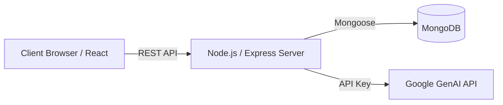

# Lumina AI

Lumina AI is a full-stack AI chat application featuring a secure authentication system and intelligent conversational capabilities powered by the Google Gemini API.

## Architecture



## Features

- **Intelligent Chat:** Conversational interface utilizing Google Gemini.
- **Markdown Rendering:** AI responses support markdown syntax, including code blocks and highlighting.
- **Authentication:** JWT-based signup and login with encrypted passwords (bcrypt).
- **History Management:** Automatic persistence of user chats with view, update, and delete capabilities.
- **Responsive UI:** Built with Radix UI, Tailwind CSS, and Framer Motion.

## Technology Stack

- **Frontend:** React 19, TypeScript, Vite, Tailwind CSS, Radix UI, Framer Motion
- **Backend:** Node.js / Bun, Express.js, TypeScript, Google GenAI SDK
- **Database:** MongoDB (Mongoose)

## Project Structure

```text
perplexity/
├── backend/            
│   ├── ai/             # Gemini API integration
│   ├── middleware/     # Authentication & request validation
│   ├── model/          # Database schemas (User, Chat)
│   └── index.ts        # Application entry point
└── frontend/           
    ├── public/         # Static assets
    └── src/            
        ├── features/   # Modular components (auth, chat, landing)
        └── App.tsx     # Application routing
```

## Installation and Setup

### Prerequisites
- Node.js (v18+) or Bun
- MongoDB instance (local or Atlas)
- Google Gemini API Key

### Backend Setup
1. Navigate to the `backend` directory:
   ```bash
   cd backend
   bun install
   ```
2. Create a `.env` file in the `backend` directory:
   ```env
   PORT=3002
   MONGODB_URI=your_mongodb_connection_string
   JWT_SECRET=your_jwt_secret_key
   GEMINI_API_KEY=your_google_gemini_api_key
   ```
3. Start the backend server:
   ```bash
   bun run dev
   ```

### Frontend Setup
1. Navigate to the `frontend` directory:
   ```bash
   cd frontend
   npm install
   ```
2. Start the development server:
   ```bash
   npm run dev
   ```

## API Endpoints

### Authentication
- `POST /signup` - Register a new user
- `POST /signin` - Authenticate user and return JWT
- `GET /profile` - Retrieve the currently authenticated user

### Chat Operations
- `POST /chat` - Generate AI response and save the conversation
- `GET /history` - Retrieve all chats for the authenticated user
- `GET /history/:id` - Retrieve a specific chat
- `PATCH /history/:id` - Update a specific chat's prompt
- `DELETE /history/:id` - Delete a specific chat
